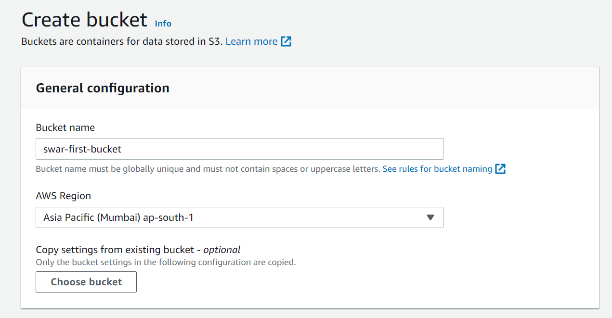
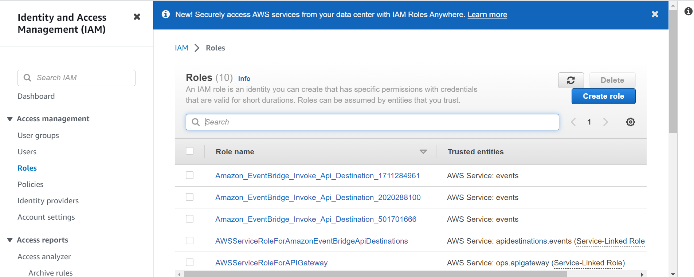
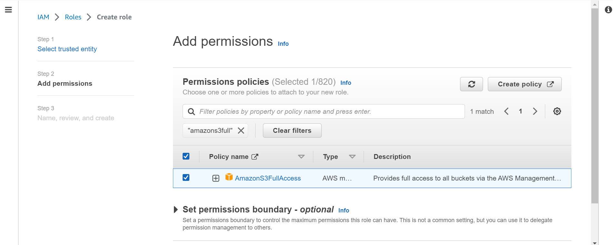

Let's create S3 buckets!!

There are several ways we can create S3 buckets in AWS:
1. AWS Management Console: You can create an S3 bucket using the AWS Management Console, which provides a web-based interface for managing AWS resources.
2. AWS CLI: The AWS Command Line Interface (CLI) is a unified tool to manage your AWS services. You can use the CLI to create and manage S3 buckets.
3. AWS SDK: AWS Software Development Kit (SDK) provide programmatic access to AWS Services, including S3. You can use the SDKs to create and manage S3 buckets.
4. AWS CloudFormation: AWS CloudFormation is a service that helps you model and set up your AWS resources so that you can spend less time managing those resources and more time focusing on your applications that run on in AWS. You can use CloudFormation to create and manage S3 buckets.
5. AWS Terraform: Terraform is an open-source 'infrastructure as a code' tool that you can use to manage your AWS resources, including S3 buckets.
6. AWS S3 API: You can use the AWS S3 API directly to create and manage buckets programmatically.

--lab--
1. Create a Simple S3 bucket via Management Console:
   1. Log in into the AWS Management Console.
   2. Navigate to the S3 service.
   3. Click on "Create Bucket" button.
   4. Enter a globally unique name for the S3 bucket. The name should be globally unique across all AWS accounts.
   5. Select a region for the bucket. This determines the geographical region where the data will be stored. To minimize latency, choose the region closest to your users (in this case: you )
      
   6. Leave the default options for "Copy From the existing bucket" and also for the "Object Ownership", "Block Public access settings for this bucket", "Bucket Versioning", "Tags", "Default encryption" section.
```      
     Object ownership: Object ownership property let's you control the ownership of the objects written to this bucket via other AWS accounts.
It comes with 2 options:
1. ACL disabled (recommended): All the objects in the bucket are owned by this account.       Therefore, the account owns the bucket and the objects, and can be accessed only by using policies. 
2. ACL enabled: Objects in the bucket can be owned by other AWS accounts. 
With the use of ACLs, the bucket owner can grant permissions to other AWS accounts/users to read and write objects objects in the bucket.
Additionally, the object ownership should be either set to 
- "Bucket owner preferred" : creator of the bucket will be the object owner. 
- "Object writer" : the writer of the object will be the object owner.
```

<div class ="alert alert-block alert-warning">
⚠ <b> Enabling ACLs is not recommended </b> as it can add complexity to managing permissions and can potentially create security risks if not configured properly. 
Instead, it is recommended to use bucket policies and IAM policies to manage access control for s3 buckets. 
Bucket policies allow you to specify permissions for a bucket or objects within the bucket, while IAM policies allow you to define permissions for individual users or groups.
By using these methods, you can more easily manage and audit permission for S3 buckets and ensure that they are properly secured.
</div>

<div class ="alert alert-block alert-warning">
❓ <b> Bucket policies and IAM policies, how are they different? </b> 
 1. Bucket policies: Bucket policies attached to S3 buckets and allow you to control access to the objects in the bucket.
                     Bucket policies use JSON syntax to define rules that specify who can access the bucket and what actions they can perform.
                     Bucket policies can be used to grant access to specific AWS accounts, IAM users or roles, and even to specific IP addresses.
                     Here is an example, of a bucket policy that grants read access to objects in a bucket to a specific IAM user:

```json
{
   "Version": "2012-10-17",
   "Statement": [
      {
         "Sid": "AllowGetObject",
         "Effect" : "Allow",
         "Principal": {
            "AWS" : "arn:aws:iam::123456789012:user/username"
          },
         "Action": "s3:GetObject",
         "Resource": "arn:aws:s3:::my-bucket/*"
      }
   ]
}
```

 2. IAM policies: IAM policies on the other hand, are attached to IAM users, groups or roles and control what those entities can do within AWS.
                  IAM policies use the same JSON syntax as the bucket policies, but they are used to control access to a wide range of AWS resources, not just S3 buckets.
                  Here is an example of IAM policy that allow user to access EC2 instances:
```json
{
   "Version" : "",
   "Statement" : [
      {
         "Effect" : "Allow", 
         "Action" : [
            "ec2:Describe",
            "ec2:StartInstances",
            "ec2:StopInstances",
            "ec2:TerminateInstances"
         ],
         "Resource" : "*"
      }
   ] 
}
```

In summary, bucket policies are used to control access to S3 buckets and their objects,
while IAM policies are used to control access to a wide range of AWS resources.
</div>

   7. Click on the "Create bucket" button.


--lab--
2. Create an S3 bucket along with a new IAM role via Management Console:
   1. Log in into the AWS Management Console.
   2. Click on the "Create bucket" button.
   3. In the "Bucket Name and region" section, enter a unique name for your bucket and select in the region in which you want to create the bucket.
   4. Click "Next" until you reach the "Set Permissions" section.
   5. Under "Manage public permissions", select "Block public access" to prevent unauthorized access to your bucket.
   6. In the "Set up access control" section, select "Grant access to an AWS Account".
   7. Enter the AWS account number or IAM user account ID of the account you want to grant access to.
   8. Click "Next" until you reach the "Review" section.
   9. Review your bucket settings and click on "Create Bucket".

   Let's create a new IAM role to access the S3 bucket:
   1. Navigate to the "IAM" service in the AWS Management Console.
   2. Click on "Roles" and then click on "Create Role".
   
   3. Select "AWS Service" as the trusted entity and choose "Lambda" as the service that will use the role.
   4. Click "Next" until you reach the "Add Permissions" section.
   5. Select the policy that grants access to your S3 bucket i.e. `AmazonS3FullAccess`.
   
   6. Click "Next" until you reach the "Review" section.
   7. Enter a name for your role and click "Create Role".


--lab--
3. Create an S3 bucket via AWS CLI (Command Line Interface)
   1. First we need to install the AWS CLI. To install refer to this <a href="https://docs.aws.amazon.com/cli/latest/userguide/getting-started-install.html">link.</a>
   2. Now we need to configure our AWS CLI, but before we do that we need to get the access keys (Access Key ID and Secret Access Key).
      1. Log into your AWS Management Console via an IAM user.
      2. Click on your account name in the top right corner of the screen and then choose the "Security Credentials" from the dropdown menu.
      3. Under the "Access Keys" section, choose the "Create access key" button to generate a new set of keys or find your existing ones.
      
         `AWS Management Console may prompt to not recommend access key for root user which is not considered a best practice because you are not supposed to limit the permissions for root user.`

 --lab--
 4. Create an S3 bucket via Terraform that can be accessed by an IAM user.
		[[install-terraform]]
	1. Create a new Terraform project and navigate to the project directory. 
	2. In the project directory, create a new file named `main.tf` and open it in a text editor.
	3. Inside the `main.tf` file, add the following code:
	
	```python	
	resource "aws_s3_bucket" "my_bucket" {
		bucket = "my-bucket-name"
		acl = "private"
	 
	 
		tags = {
			Name = "My bucket",
			Environment = "dev"
		}
	
		versioning {
			enabled = true 
		}
	
		lifecycle {
			prevent_destroy = false
		}
	}
	
	```
	In this code, replace "my-bucket-name" with the unique name of your S3 bucket.

	4. Next, add the following code to create an IAM user:
		

	```python
	
	resource "aws_iam_user" "my_user" {
		name = "my-user"
	}
	
	```

	Replace "my-user" with a unique name for IAM user.

	5. Now add the following to add create an access key for the IAM user:
		 ```python 
	resource "aws_iam_access_key" "my_user_access" {
		user = aws_iam_user.my_user.name
	}
```
	6. Finally, add the following code to grant the IAM user permissions to access the S3 bucket:

	  ```python
	resource "aws_bucket_policy" "my_bucket_policy" {
		bucket = aws_s3_bucket.my_bucket_id

		policy = <<EOF
		{
			"Version" : "2012-10-17",
			"Statement" : [
				{
					"Sid" : "AllowS3Actions",
					"Effect" : "Allow",
					"Principal" : {
						"AWS" : "${aws_iam_user.my_user.arn}"
					},
					"Action": [
						"s3:ListBucket",
						"s3:GetBucket",
						"s3:PutObject"
					],
					"Resource": [
						"${aws_s3_bucket.my_bucket.arn}",
						"${aws_s3_bucket.my_bucket.arn}/*"
					]
				}
			]
		}
		EOF
	}
```
	This will create an S3 bucket policy that grants the IAM policy that grants the IAM user permission to list, get and put objects in the bucket.

7. Save the `main.tf` file and run the following command in the project directory:
	
	`terraform init`

	This command initializes the Terraform project.

8. Next, run the following command to preview the changes that Terraform will make:

	`terraform plan`

	This command will show you the changes that Terraform will make to your AWS infrastructure.

9. Finally, run the following command to apply the changes:

	`terraform apply`

	This command will create the s3 bucket, IAM user, access key, and bucket policy.
	
	That's it! You have now created an S3 bucket via an IAM user using Terraform.

	


	