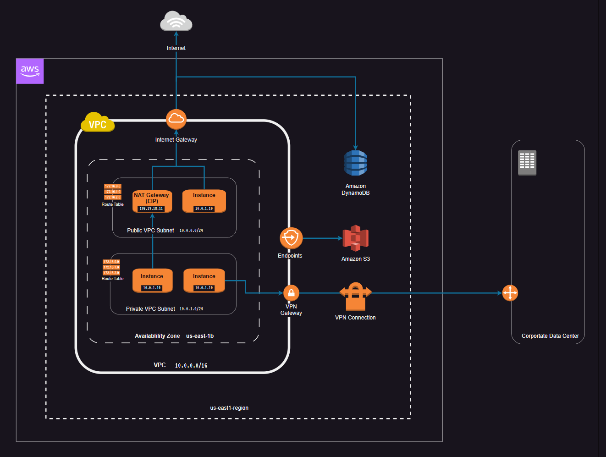
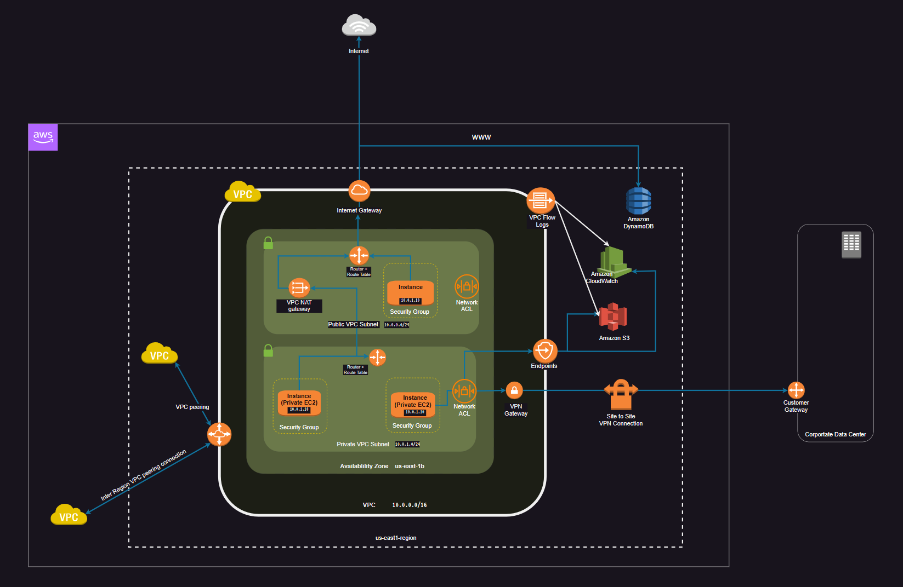

# VPC (Virtual Private Cloud)
As a Dev or DevOps professional, there are a several things you should know about VPC (Virtual Private Cloud) in order to use it effectively.
1. What is VPC?
VPC is a virtual network environment provided by Amazon Web Services(AWS) that allows you to launch AWS resources into a virtual network that you define.
It enables you to create a private, isolated section of the AWS cloud that you can customize to your specific needs.
2. VPC components:
VPC is composed of several key components, including subnets, route tables, security groups, and network access control lists (ACLs).
Each of these components serves a specific purpose in defining the network topology and security for your VPC.
3. IP address management:
VPC allows you to define your own IP address ranges, which gives you greater control over your network and enables you to create private IP addresses for your resources.
You can also use Network Address Translation(NAT) to allow resources in your private subnet to connect to the internet.
4. Security:
VPC provides several security features, including security groups and network ACLs, which enable you to control access to your resources. Security groups operate at the instance level, while network ACLs operate at the subnet level.
5. Integration with other AWS services:
VPC can be integrated with other AWS services, such as EC2, RDS, and Elastic Load Balancing, to create fully functional and scalable cloud-based infrastructure.
VPC peering also enables you to connect two VPCs together to share resources and communicate securely.
6. Network monitoring:
VPC provides several tools for monitoring your network traffic and identifying potential issues, such as CloudWatch Logs and VPC Flow Logs. These tools can help you troubleshoot issues and optimize the performance of your network.
7. VPC:
Designing a VPC can be complex, and there are several best practices to follow to ensure that your network is secure, scalable, and cost-effective. For example, you should design your network topology to avoid single point of failure and ensure that your resources are distributed across multiple availability zones.

In summary, VPC is a powerful tool for creating a private, isolated networks within the AWS cloud, it is important to understand the key components and the features in order to manage your networks effectively. By following best practices and monitoring your network performance, you can create a secure and scalable infrastructure that meets your specific needs.

# The key components of VPC

1. Subnets: A subnet is a range of IP addresses within a VPC. It allows you to partition a VPC into smaller networks for better network management, security and routing. A subnet is identified by its CIDR (Classes Inter-Domain Routing), which defines a range of IP addresses.
2. Route Tables: A route table is a set of rules, called routes, that are used to determine where network traffic is directed. Each subnet must be associated with a route table, which defines the rules for traffic routing within the VPC.
3. Internet Gateway: Internet Gateway is a horizontally scaled, redundant, and highly available VPC component that allows communication between instances in the VPC and the internet. It serves as a gateway for traffic from the internet.
4. NAT Gateway: A NAT (Network Address Translation) gateway is a highly available, managed service that enables instance in a private subnet to connect to the internet or other AWS services while remaining private.
5. Security Groups: A security group acts as a virtual firewall for your instances to control inbound and outbound rules separately. 
6. Network ACL: Network Access Control (ACLs) are an optional layer of security for your VPC that acts as firewall for controlling in and out of one or more subnets. Network ACLs are stateless, which means you must configure both inbound and outbound rules separately.
7. VPC Connections: A VPN (Virtual Private Network) connection provides a secure and encrypted tunnel between your on-premises network and your VPC. You can use VPN connections to extend your on-premises network on cloud, or to connect remote offices or mobiles workers to your VPC.

Overall, these components provide a flexible and scalable networking infrastructure that enables you to create and manage your own virtual private network in the AWS cloud.

